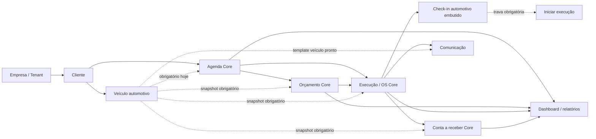

# ARCH-02 — Discovery de desacoplamento do domínio automotivo

> Estado: discovery arquitetural, sem alteração de runtime ou schema
>
> Base inspecionada: `main` em `37d950dc6686a44513042288c48677d6e801e1e5`
>
> Data do levantamento: 2026-09-18

## Executive Summary

O Detara já possui um núcleo substancialmente reutilizável por empresas de prestação de serviços: identidade e multi-tenancy, clientes, catálogo de serviços e pacotes, agenda temporal, orçamento e aprovação, execução por Ordem de Serviço (OS), contas a receber e pagar, despesas, pagamentos, dashboards, relatórios, usuários, permissões, comunicação, assinatura e Platform Admin. O foco comercial pode continuar em estética automotiva sem obrigar esse núcleo técnico a depender de conceitos automotivos.

O impedimento atual para um tenant não automotivo não é a existência do módulo de veículos, mas o fato de `VeiculoId` e o snapshot descritivo do veículo serem obrigatórios no encadeamento transacional `Agendamento -> Orçamento -> OS -> Conta a Receber`. A exigência aparece simultaneamente no banco, domínio, Commands/Validators/Handlers, contratos HTTP, repositórios e frontend. Além disso, uma OS pode ser criada sem check-in concluído, mas não pode iniciar a execução antes dele, mesmo quando checklist e fotos estão desabilitados.

A evolução é viável na mesma aplicação, API e banco, sem fork e sem criar um substituto genérico especulativo para `Veiculo`. O menor caminho seguro é:

1. introduzir capacidades por empresa, preservando todas as capacidades atuais ligadas para tenants existentes;
2. tornar o vínculo com veículo opcional no backbone transacional;
3. condicionar a obrigatoriedade de veículo e check-in às capacidades da empresa;
4. adaptar consultas, UI, PDFs, templates, dashboard, relatórios e onboarding;
5. manter nomes técnicos estáveis e permitir aliases somente na apresentação, caso o produto realmente precise deles.

Não foi encontrado risco crítico imediato para os tenants automotivos atuais. Foram classificados oito riscos altos de evolução, principalmente por mudança coordenada de nullability, invariantes, contratos, isolamento multi-tenant e compatibilidade histórica.

### Métricas aproximadas do discovery

| Métrica | Resultado | Critério |
|---|---:|---|
| Arquivos relacionados a veículo | 166 | União de `Veiculo`, `Veículo`, `VeiculoId`, `Placa` e `Quilometragem` em `src`, `tests` e `docs`, excluindo migrations geradas e artefatos de build |
| Arquivos relacionados a check-in | 42 | União de termos de check-in, quilometragem de entrada, checklist e fotos operacionais |
| Tabelas que armazenam `VeiculoId` | 5 | `Agendamentos`, `Orcamentos`, `OrdensServico`, `ContasReceber`, `VeiculosFotos` |
| Tabelas com FK real para `Veiculos` | 1 | `VeiculosFotos`; as quatro tabelas transacionais usam ID/snapshot sem FK cross-module |
| Fluxos genéricos bloqueados por veículo obrigatório | 5 | Agenda, orçamento, execução/OS, contas a receber e comunicação operacional derivada da OS |
| PDFs/templates com premissas automotivas | 3 | PDF de orçamento, template padrão de e-mail e template padrão de WhatsApp |
| Áreas de UI afetadas | 10 | Navegação, clientes/veículos, agenda, orçamentos, OS/check-in, financeiro, dashboard, relatórios/catálogo, onboarding/configurações e comunicação |
| Riscos altos/críticos | 8 / 0 | Classificação detalhada em [Risks](#risks) |

As buscas obrigatórias também encontraram, sem migrations geradas: `Veiculo` em 153 arquivos, `VeiculoId` em 55, `CheckIn` em 21, `Check-in` em 5, `Placa` em 96, `Quilometragem` em 21, `Marca` em 65, `Modelo` em 40, `Combustivel` em 0, `Avaria` em 0, `OrdemServico` em 115, `Ordem de Serviço` em 14 e `OS` em 73. `Marca`, `Modelo` e `OS` têm falsos positivos semânticos; por isso as conclusões abaixo também foram verificadas em entidades, mappings, migrations, validators, contratos, componentes, consultas, PDFs e templates.

## Current Architecture

O sistema é um monólito modular organizado por camadas (`Domain`, `Application`, `Contracts`, `Infrastructure`, `Api`, `Web`). O `DetaraDbContext` é compartilhado, mas os módulos preservam ownership lógico conforme `docs/architecture/module-boundaries.md`.

### Módulos e ownership relevantes

| Área | Ownership atual | Estado de genericidade |
|---|---|---|
| Empresa, identidade, autenticação, usuários e perfis | Platform/Identity | Genérico |
| Cliente e veículo | Clientes | Cliente é genérico; veículo é vertical automotiva |
| Serviços, categorias e pacotes | Catálogo | Genérico |
| Agendamento | Agenda | Conceito genérico, estrutura atualmente dependente de veículo |
| Orçamento, OS, checklist e evidências | Atendimento | Conceitos em grande parte genéricos; snapshots e ciclo da OS estão acoplados a veículo/check-in |
| Contas a receber e pagamentos | Financeiro | Conceito genérico, snapshot obrigatório de veículo |
| Contas a pagar, despesas e recorrências | Financeiro | Genérico e independente de veículo |
| E-mail, WhatsApp e histórico de comunicação | Notificações | Infraestrutura genérica; caso de uso e templates atuais são automotivos |
| Dashboard e relatórios | Composição de leitura | Métricas genéricas e labels/métricas automotivas misturadas |
| Assinatura e Platform Admin | Assinaturas/Platform | Genérico |

As referências entre Agenda, Atendimento, Financeiro e Clientes usam principalmente IDs e snapshots, e não grafos EF cross-module. Isso reduz a dificuldade de tornar veículo opcional: a maior parte do trabalho é alterar invariantes e nullability, não desmontar relacionamentos físicos complexos.

## Core vs Automotive Domain

### Definição proposta de Detara Core

Detara Core é o conjunto de capacidades úteis para uma empresa de prestação de serviços que atende clientes, vende serviços/pacotes, planeja agenda, formaliza orçamento, acompanha execução e controla o financeiro. Entram no Core:

- empresa, identidade, autenticação, sessão e multi-tenancy;
- usuários, perfis e permissões;
- clientes e seus canais de contato;
- categorias, serviços, pacotes, preços e durações;
- agenda, disponibilidade temporal e sobreposições;
- orçamento, itens, aprovação e histórico;
- execução/OS, itens autorizados, estados, checklist genérico e evidências genéricas;
- contas a receber, pagamentos, contas a pagar, despesas e recorrências;
- dashboard, relatórios e onboarding compostos de acordo com capacidades;
- comunicação por e-mail/WhatsApp, templates e histórico;
- assinatura comercial e Platform Admin.

`OrdemServico` pode continuar sendo o nome técnico do agregado Core. O agregado representa escopo autorizado, execução, evidências, histórico e conclusão — conceitos não exclusivos de veículos. Um alias futuro como “Projeto” ou “Atendimento” deve ser apenas apresentação configurada, sem renomear tabelas, rotas, eventos, logs e tipos internos a cada segmento.

### Definição proposta da vertical automotiva

O código real confirma como automotivos:

- cadastro de veículo e vínculo cliente-veículo;
- tipo de veículo, placa ou identificação alternativa, marca, modelo, versão, ano, cor e quilometragem;
- galeria de fotos do veículo;
- check-in de entrada da OS;
- quilometragem de entrada;
- fotos categorizadas como entrada, durante e saída quando usadas como inspeção veicular;
- mensagens de “veículo pronto para retirada”;
- métricas e labels de veículos aguardando retirada/entregues;
- filtros por placa e descrição do veículo;
- dados demo da Prime Detail.

Não existem hoje campos ou regras de combustível, avarias ou assinatura de check-in. Portanto, esses itens não devem ser tratados como dependências existentes; são apenas possibilidades futuras da vertical.

### Entidades e agregados

| Entidade/agregado | `VeiculoId` direto | Obrigatório hoje | Validação/regra automotiva | Pode existir sem veículo hoje? | Deveria poder? |
|---|---:|---:|---|---:|---:|
| `Empresa` | Não | — | Nenhuma; não possui segmento/capacidades | Sim | Sim |
| `Cliente` | Não | — | Coleção opcional de veículos | Sim | Sim |
| `Veiculo` | N/A | Cliente obrigatório | Placa, marca/modelo, anos, tipo, quilometragem | N/A | Capacidade opcional |
| `Servico` / `Pacote` | Não | — | Nenhuma | Sim | Sim |
| `Agendamento` | Sim | Sim, `Guid` | snapshot de descrição e placa; cliente-veículo ativo | Não | Sim |
| `Orcamento` | Sim | Sim, `Guid` | snapshot de descrição e placa | Não | Sim |
| `OrdemServico` | Sim | Sim, `Guid` | snapshot, check-in, quilometragem, fotos entrada/durante/saída, retirada | Não | Sim |
| `OrdemServicoChecklist` | Não | — | Estrutura de perguntas/respostas é genérica | Só por meio da OS | Sim |
| `OrdemServicoFoto` | Não direto | OS obrigatória | Categorias têm semântica operacional, mas evidência é genérica | Só por meio da OS | Sim |
| `ContaReceber` | Sim | Sim, `Guid` | snapshot de descrição e placa | Não, pois nasce da OS atual | Sim |
| `Pagamento` | Não | — | Nenhuma | Sim, via conta | Sim |
| `ContaPagar` / despesas | Não | — | Nenhuma | Sim | Sim |
| `ComunicacaoCliente` | Não direto | OS obrigatória no caso atual | tipo `VeiculoPronto` e snapshots derivados | Não no fluxo atual | A infraestrutura sim; o caso automotivo deve ser opcional |
| `Usuario` / `Perfil` / `Permissao` | Não | — | Permissões específicas de veículo/OS | Sim | Sim |

### Cliente sem veículo

Um cliente pode ser criado, editado, listado e consultado sem nenhum veículo. O construtor de `Cliente` não exige veículo, e a relação é uma coleção vazia válida. Continuam funcionando cadastro/contato do cliente, catálogo, despesas, usuários, empresa e assinatura. O detalhe Cliente 360 consegue existir, mas seus agrupamentos de atendimentos e orçamentos são estruturados por veículo. Agenda, orçamento, OS e a conta a receber resultante não podem ser iniciados para esse cliente sem cadastrar veículo. O onboarding também considera o marco “cliente e veículo ativo” incompleto.

## Dependency Map



### Dependências por camada

| Fluxo | Banco | Domínio/Application | API | Frontend | Severidade | Esforço |
|---|---|---|---|---|---|---|
| Cliente sem veículo | Permitido | Permitido, mas relacionamento operacional agrupa por veículo | Contratos do cliente expõem veículos | CTAs conduzem ao cadastro de veículo | Média | Médio |
| Agenda | `VeiculoId` e descrição não nulos | `Guid`, `NotEmpty`, consulta cliente-veículo | request/response sempre têm veículo | seletor e labels obrigatórios | Alta | Grande |
| Orçamento | `VeiculoId` e descrição não nulos | snapshot e validators obrigatórios | request/response/PDF sempre têm veículo | formulário, lista e detalhe assumem veículo | Alta | Grande |
| OS | `VeiculoId` e descrição não nulos | snapshot obrigatório; origem valida mesma dupla cliente-veículo | detalhe sempre devolve veículo | cabeçalho, fluxo e comunicação assumem veículo | Alta | Grande |
| Check-in | Campos nullable na OS | execução exige `CheckInEmUtc` | endpoint fixo `/check-in` | etapa fixa na progressão | Alta | Médio |
| Financeiro | snapshot de veículo não nulo | geração da conta exige veículo | contratos sempre devolvem veículo | listas/detalhe exibem veículo | Alta | Médio |
| Comunicação | sem FK de veículo | dados de template exigem descrição | comando parte da OS | modal “veículo pronto” | Média | Médio |
| Dashboard/relatórios | consultas usam snapshots | DTOs nomeiam veículo/entrega | payloads automotivos | cards e timeline automotivos | Média | Médio |

## Database Couplings

O schema atual contém cinco tabelas com `VeiculoId`. Somente `VeiculosFotos` possui FK física para `Veiculos`. Agenda, Orçamento, OS e Financeiro preservam IDs e snapshots sem FK cross-module; isso está alinhado ao ownership modular, mas os campos não nulos continuam sendo uma restrição estrutural.

| Tabela/entidade | Campo | Obrigatório? | FK / delete behavior | Índices e constraints | Tenant | Impacto para não automotivo | Severidade |
|---|---|---:|---|---|---|---|---|
| `Veiculos` / `Veiculo` | `ClienteId` | Sim | FK composta `(EmpresaId, ClienteId)` -> `Clientes`; `Restrict` | índice `(EmpresaId, ClienteId)`; AK `(EmpresaId, Id)` | `EmpresaId` em chave e query filter | O módulo inteiro deve poder ficar desabilitado | Baixa |
| `VeiculosFotos` / `VeiculoFoto` | `VeiculoId` | Sim | FK composta para `Veiculos`; `Restrict` | índice histórico; único da foto principal com filtro; não integra PK | `EmpresaId` na FK/índices e query filter | Capacidade de fotos de veículo deve acompanhar Veículos | Baixa |
| `Agendamentos` / `Agendamento` | `VeiculoId` | Sim | Sem FK para `Veiculos` | índice `(EmpresaId, VeiculoId)`; não integra PK/AK | `EmpresaId` separado e query filter | Impede qualquer agendamento sem veículo | Alta |
| `Agendamentos` | `VeiculoDescricaoSnapshot` | Sim | — | tamanho 200 | Mesmo registro tenant | Exige valor automotivo mesmo sem vínculo | Alta |
| `Agendamentos` | `VeiculoPlacaSnapshot` | Não no modelo atual | — | tamanho 10 | Mesmo registro tenant | Compatível com veículo sem placa, mas ainda automotivo | Baixa |
| `Orcamentos` / `Orcamento` | `VeiculoId` | Sim | Sem FK para `Veiculos` | índice `(EmpresaId, VeiculoId)`; não integra PK/AK | `EmpresaId` separado e query filter | Impede proposta genérica | Alta |
| `Orcamentos` | `VeiculoDescricaoSnapshot` | Sim | — | tamanho 200 | Mesmo registro tenant | PDF e documento exigem descrição | Alta |
| `Orcamentos` | `VeiculoPlacaSnapshot` | Não no modelo atual | — | tamanho 10 | Mesmo registro tenant | Já aceita não emplacado | Baixa |
| `OrdensServico` / `OrdemServico` | `VeiculoId` | Sim | Sem FK para `Veiculos` | índice `(EmpresaId, VeiculoId)`; não integra PK/AK | `EmpresaId` separado e query filter | Impede execução sem veículo | Alta |
| `OrdensServico` | descrição/placa snapshots | Descrição sim; placa não | — | tamanhos 200/10 | Mesmo registro tenant | Cabeçalhos, buscas e comunicação assumem veículo | Alta |
| `OrdensServico` | campos de check-in | Todos nullable | — | sem constraint de estado no DB | Mesmo registro tenant | Banco permite OS aberta sem check-in; domínio bloqueia o avanço | Média |
| `ContasReceber` / `ContaReceber` | `VeiculoId` | Sim | Sem FK para `Veiculos` | índice `(EmpresaId, VeiculoId)`; não integra PK/AK | `EmpresaId` separado e query filter | Acopla financeiro genérico à vertical | Alta |
| `ContasReceber` | descrição/placa snapshots | Descrição sim; placa não | — | tamanhos 200/10 | Mesmo registro tenant | Contratos e pesquisa financeira exigem descrição | Alta |

Migrations relevantes: `AddClientesEVeiculos`, `AddAgenda`, `AddOrcamentos`, `AddVehiclePhotos`, `AddOrdensServico`, `AddContasReceberEPagamentos`, `SuportaVeiculosNaoEmplacados` e `AddFotosDuranteOperacao`. Não há migration proposta por este discovery.

Uma futura mudança deve usar expand-and-contract: adicionar nullability compatível, publicar leitores tolerantes, habilitar fluxos sem veículo somente após todos os consumidores aceitarem ausência e nunca preencher snapshots automotivos artificiais. Dados existentes permanecem intactos.

## Domain/Application Couplings

### Agenda

- `Agendamento` recebe `Guid veiculoId`, chama `ExigirId` e exige `VeiculoDescricaoSnapshot`.
- `CriarAgendamentoCommand` e `AtualizarAgendamentoCommand` usam `Guid`, e o validator aplica `NotEmpty`.
- `AgendaFluxo.ValidarClienteVeiculoAsync` busca a dupla no tenant, verifica ownership e exige cliente e veículo ativos.
- A edição proíbe mudar cliente ou veículo; isso é uma boa invariante histórica, mas deverá comparar opcionais no futuro.
- Repositórios pesquisam por descrição/placa e sempre projetam dados do veículo.

Conclusão: não é possível criar agendamento sem veículo no domínio, Application, banco, contrato HTTP ou frontend. Severidade alta.

### Orçamento

- `PartesOrcamentoSnapshot` contém `Guid VeiculoId` e descrição obrigatória.
- `Orcamento.AtualizarRascunho` exige ID e descrição.
- Commands de criar/atualizar e seus validators exigem `VeiculoId`.
- `OrcamentoFluxo.PrepararPartesAsync` valida que veículo pertence ao cliente e que ambos estão ativos.
- Origem por agenda e conversão para OS exigem igualdade entre cliente e veículo.
- O orçamento é conceitualmente um documento genérico de serviço, mas estruturalmente automotivo hoje.

### Ordem de Serviço e check-in

- `PartesOrdemServicoSnapshot` exige veículo.
- Toda nova OS precisa de um agendamento de origem; o handler herda o veículo do agendamento/orçamento.
- A nomenclatura OS está profundamente presente em entidade, tabelas, contratos, permissões, rotas, eventos e logs. Isso não impede reutilizar o conceito, mas torna uma renomeação técnica ampla desnecessária e arriscada.
- Não existe agregado/tabela `CheckIn`: os campos ficam em `OrdensServico`; checklist e fotos são entidades filhas da OS.
- `RealizarCheckIn` aceita quilometragem opcional, checklist e fotos conforme configuração.
- Mesmo com checklist e todas as fotos desabilitados, `IniciarExecucao` exige `CheckInEmUtc`. Portanto, check-in é uma etapa obrigatória da máquina de estados atual.
- A OS pode existir aberta sem check-in, mas não pode avançar para `EmExecucao`.
- Checklist e evidências são conceitos reaproveitáveis no Core. Quilometragem, entrada/saída automotiva e “aguardando retirada” são apresentação/regras verticais.

Check-in pode se tornar capacidade opcional sem comprometer o ciclo da OS, desde que a transição de início use uma política operacional explícita: quando `CheckIn` estiver habilitado, manter as invariantes atuais; quando estiver desabilitado, permitir a transição sem criar um check-in fictício. Essa decisão deve viver em uma política/serviço de domínio ou em uma entrada explícita do caso de uso, não em condicionais de segmento espalhadas.

### Financeiro

- `ContaReceber` exige OS, cliente e veículo não vazios e descrição obrigatória.
- A conta é criada quando a OS é concluída e copia snapshots automotivos.
- Pagamento, estorno, vencimento, contas a pagar, despesas e recorrências não possuem regra automotiva.
- O acoplamento deve ser removido do snapshot da conta sem alterar a origem financeira pela OS.

### Anexos e fotos

- `VeiculoFoto` é claramente capacidade automotiva e possui armazenamento por caminho de veículo.
- `OrdemServicoFoto` é evidência de execução e pode permanecer no Core; suas categorias e exigências podem ser parametrizadas/capacitadas.
- Não se recomenda unificar os dois tipos agora: possuem ciclos, ownership e finalidades diferentes.

### Classificação dos principais usos de veículo

| Uso | Classificação |
|---|---|
| `Veiculo`, `VeiculoFoto`, API e repositórios próprios | Automotivo |
| `VeiculoId` obrigatório em Agenda/Orçamento/OS/Financeiro | Integração indevida da vertical no Core |
| snapshots históricos de veículo | Integração; válidos quando a capacidade está ligada |
| labels, colunas, filtros e breadcrumbs | Apresentação |
| índices e mappings de `VeiculoId` | Infraestrutura |
| placa, marca/modelo, ano, cor e quilometragem | Automotivo |
| checklist e fotos de execução | Core potencial, com políticas automotivas opcionais |
| agrupamento do Cliente 360 por veículo | Apresentação/read model automotivo |

## API Couplings

| Área/endpoints | Premissa atual | Pode permanecer igual sem veículo? | Ajuste futuro mínimo |
|---|---|---:|---|
| `/api/veiculos/**` | módulo automotivo explícito | Sim, se bloqueado por capacidade | adicionar autorização por capacidade além de RBAC |
| `/api/agendamentos` | request exige `Guid VeiculoId`; responses sempre retornam descrição/placa | Não | `VeiculoId?`, snapshot opcional e contrato versionado/compatível |
| `/api/agenda/clientes/{id}/veiculos` | etapa fixa do formulário | Não como requisito | manter endpoint automotivo; fluxo Core não deve depender dele |
| `/api/orcamentos` | create/update/detail/list/PDF sempre têm veículo | Não | veículo opcional e apresentação condicional |
| `/api/ordens-servico` | create aceita nullable no wire, mas o fluxo herda veículo obrigatório; detalhe retorna não nullable | Não | alinhar contrato real, políticas e projeções opcionais |
| `/api/ordens-servico/{id}/check-in` | etapa fixa protegida por permissão de editar OS | Não para tenant sem capacidade | endpoint continua, mas backend rejeita por capacidade desabilitada; início pula somente por política explícita |
| `/api/financeiro/contas-receber` | payload sempre inclui veículo | Não | snapshot opcional; pesquisa tolerante |
| `/api/clientes` | cliente genérico, detalhe inclui coleção de veículos | Em grande parte | coleção pode permanecer vazia; ocultar integrações quando desabilitadas |
| catálogo, despesas, usuários, empresa, assinatura e autenticação | sem dependência automotiva | Sim | nenhuma mudança estrutural |

Os Controllers usam políticas de permissão, mas nenhum endpoint consulta uma capacidade da empresa. No modelo futuro, uma ação deve satisfazer as duas dimensões quando aplicável: empresa possui a capacidade **e** usuário possui a permissão. Ocultar o menu nunca será suficiente.

## Frontend Couplings

Foram encontrados 38 arquivos do projeto Web com referências automotivas diretas; agrupados, representam dez áreas de produto:

1. **Navegação:** `NavMenu.razor` mostra Veículos somente por permissão, sem capacidade da empresa; favoritos também podem manter link incompatível.
2. **Clientes/Veículos:** listas, formulários, Cliente 360, jornada do veículo, fotos e CTAs pressupõem continuidade por veículo.
3. **Agenda:** formulário requer seleção/cadastro rápido de veículo; cards, calendário, filtros, detalhes e empty states exibem veículo/placa.
4. **Orçamentos:** formulário, lista e detalhe carregam e exibem veículo; o PDF é acionado como documento automotivo.
5. **OS/check-in:** criação, cabeçalho, progresso, check-in, quilometragem, evidências, retirada e comunicação são fixos.
6. **Financeiro:** contas a receber e detalhes mostram veículo/placa como contexto obrigatório.
7. **Dashboard:** cards “veículos entregues/prontos”, timeline `VeiculoEntregue` e agenda do dia mostram descrição automotiva.
8. **Relatórios e histórico do catálogo:** read models de execução expõem veículo/placa; perspectivas hoje são habilitadas apenas por permissão.
9. **Onboarding/configurações:** o marco exige cliente com veículo ativo e a configuração operacional apresenta check-in/fotos para todos.
10. **Comunicação:** componentes e dialogs apresentam “veículo pronto”, mesmo que o transporte seja genérico.

O frontend não precisa de duas árvores de páginas. Deve compor a mesma jornada com blocos condicionais por capacidade: esconder módulo e campos, ajustar copy, remover validação local obrigatória e limpar favoritos inválidos. A API continua sendo a autoridade.

## Documents and Communication

### PDFs

Existe um PDF operacional relevante: `PdfOrcamentoGenerator`. Ele renderiza `VeiculoDescricao` e placa no cabeçalho sem bloco opcional. Como o contrato e o domínio também exigem descrição, um orçamento sem veículo não consegue gerar PDF válido hoje. Não foram encontrados PDFs de OS, check-in ou recibo; o PDF do Termo de Adesão é genérico e não entra no acoplamento.

Uma futura versão deve manter exatamente o layout automotivo quando a capacidade estiver ligada e omitir o bloco inteiro — sem “Veículo: —” — quando desligada.

### E-mail e WhatsApp

| Artefato | Situação | Classificação |
|---|---|---|
| Template padrão de e-mail | assunto “Seu veículo está pronto para retirada”; corpo usa `VeiculoDescricao`; tokens incluem `Placa` | Automotivo hardcoded, embora customizável por empresa |
| Template padrão de WhatsApp | nome “Veículo pronto para retirada” e texto “O seu veículo...” | Automotivo hardcoded, embora customizável por empresa |
| Renderizadores/transporte | sanitização, branding, retry e providers não dependem do segmento | Core genérico |
| Tipo de comunicação `VeiculoPronto` | evento/caso de uso automotivo | Capacidade automotiva |
| Configuração de canal | `CanalAutomaticoVeiculoPronto` | Automotiva na nomenclatura, genérica na infraestrutura |

Não foram encontrados templates automotivos específicos de agendamento ou aprovação de orçamento. A comunicação atual concentra-se no aviso de veículo pronto. Templates personalizados não resolvem sozinhos o problema, pois o tipo do evento, os tokens obrigatórios, o modal e os dados de entrada continuam automotivos.

## Permissions vs Capabilities

O RBAC atual é granular por ação de usuário: há permissões para visualizar/criar/editar veículos, agenda, orçamentos, OS e financeiro, além de finalizar OS e registrar/estornar pagamentos. Essa granularidade é adequada para responder **quem pode fazer** uma ação dentro de uma empresa.

Ela não responde **o que a empresa contratou ou utiliza**. Hoje:

- não existe `Segmento` em `Empresa`;
- não existe tabela/entidade de capacidade ativa;
- `EmpresaModulo` aparece apenas como conceito futuro na documentação/backlog;
- menu, Controllers e handlers verificam permissões, não capacidades;
- remover permissões de todos os perfis não é um mecanismo seguro de desabilitar módulo, pois mistura entitlement da empresa com administração de pessoas e pode ser reatribuído.

Regra recomendada:

```text
Permissão do usuário: este usuário pode criar veículos?
Capacidade da empresa: esta empresa utiliza o módulo Veículos?
Autorização efetiva: capacidade ligada AND permissão concedida.
```

Capacidades obrigatórias do Core podem ser sempre ligadas, sem checks redundantes em toda linha. Capacidades opcionais precisam ser aplicadas no backend nos endpoints e casos de uso que as materializam. Queries de histórico devem continuar legíveis após uma capacidade ser desligada, conforme política a definir.

## Candidate Capability Model

### Alternativas

| Alternativa | Vantagens | Problemas | Recomendação |
|---|---|---|---|
| Enum único em `Empresa` | simples | confunde segmento com comportamento; combinações rígidas | Não usar como autoridade |
| Bit flags | leitura compacta | migração, auditoria, evolução e legibilidade ruins; limite de bits | Evitar |
| JSON em `Empresa` | flexível | validação, query, índice e auditoria mais difíceis | Evitar como fonte principal |
| Feature registry só em código | catálogo seguro | não persiste decisão por tenant | Usar apenas para definições/metadados |
| Relação N `EmpresaCapacidade` + registry em código | explícita, auditável, consultável, extensível e isolável por tenant | exige tabela/cache/versionamento | Recomendada |

### Modelo recomendado

- Catálogo de códigos estáveis em código, sem tabela global obrigatória: por exemplo `Core.Clientes`, `Core.Agenda`, `Core.Orcamentos`, `Core.Execucao`, `Core.Financeiro`, `Automotivo.Veiculos`, `Automotivo.CheckIn`, `Automotivo.FotosVeiculo`.
- Entidade tenant-owned `EmpresaCapacidade` com, no mínimo, `EmpresaId`, `Codigo`, `Habilitada`, versão/auditoria e chave única `(EmpresaId, Codigo)`.
- `Empresa` pode receber futuramente um `Segmento` de metadado/preset, mas não deve ser consultada diretamente por handlers para decidir comportamento.
- Um resolvedor scoped fornece snapshot imutável das capacidades na request.
- Cache por `EmpresaId` e versão de configuração evita leitura em toda request. Alterações invalidam/incrementam a versão.
- Claims podem carregar versão ou hints para UI, mas não devem ser a única autoridade: capacidades mutáveis em JWT ficam obsoletas até renovação.
- Políticas compostas ou behaviors/filtros de endpoint devem proteger o backend. Regras de domínio recebem a decisão operacional explícita quando ela altera invariantes, em vez de consultar infraestrutura.
- Toda consulta e cache são chaves por `EmpresaId`; nunca aceitar `EmpresaId` do frontend como autoridade.

### Conjunto inicial sugerido

| Capacidade | Natureza | Tenant automotivo atual | Tenant de serviço sem veículo |
|---|---|---:|---:|
| Clientes | Core | ON | ON |
| Catálogo/Pacotes | Core | ON | ON |
| Agenda | Core | ON | ON |
| Orçamentos | Core | ON | ON |
| Execução/OS | Core | ON | ON |
| Financeiro/Despesas | Core | ON | ON |
| Comunicação | Core | ON | ON |
| Veículos | Vertical | ON | OFF |
| Fotos de veículo | Vertical dependente de Veículos | ON | OFF |
| Check-in automotivo | Vertical dependente de Execução; normalmente de Veículos | ON | OFF |

Não é necessário modelar todas as capacidades Core como toggles comerciais desde o primeiro passo. O catálogo deve expressar dependências e impedir configurações incoerentes, por exemplo `FotosVeiculo=ON` com `Veiculos=OFF`.

## Segment vs Capability

O discovery confirma a preferência conceitual: **segmento deve ser metadado e preset inicial; capacidades controlam o comportamento real**.

- `Segmento.EsteticaAutomotiva` aplica inicialmente Veículos e Check-in ligados.
- `Segmento.Audiovisual` pode aplicar ambos desligados.
- Uma empresa de PPF continua automotiva, mas pode escolher política de check-in diferente.
- Uma assistência técnica pode futuramente precisar rastrear equipamento; isso não justifica transformar `Veiculo` em `Asset` agora.

É proibitivo espalhar `if (empresa.Segmento == ...)` em handlers, páginas e PDFs. Isso surgiria sobretudo nos pontos já identificados: preparação de partes em Agenda/Orçamento/OS, transição da OS, geração de conta, menu, onboarding, documentos, templates, dashboard e relatórios. Esses pontos devem consultar capacidades/políticas específicas.

## Compatibility Matrix

Legenda: **N** necessária, **O** opcional, **NA** não aplicável.

| Nicho | Clientes | Catálogo/Pacotes | Agenda | Orçamento | Execução/OS | Financeiro | Veículos | Check-in | O que funciona hoje | Bloqueio / menor ajuste |
|---|---:|---:|---:|---:|---:|---:|---:|---:|---|---|
| Estética automotiva | N | N | N | N | N | N | N | N/O por operação | Fluxo completo | Nenhum; preservar comportamento atual |
| Filmmaker/videomaker | N | N | N | N | N, label opcional “Projeto” | N | NA | NA | clientes, catálogo, despesas, usuários | Agenda em diante exige veículo; torná-lo opcional e pular check-in |
| Fotógrafo | N | N | N | N | O/N | N | NA | NA | mesmos módulos independentes | Mesmo ajuste mínimo do audiovisual |
| Agência/social media pequena | N | N | O/N | N | N, possivelmente “Projeto” | N | NA | NA | CRM básico, catálogo e despesas | Veículo obrigatório e semântica de retirada; fluxo Core sem veículo |
| Limpeza residencial/comercial | N | N | N | O/N | N | N | NA | O, checklist genérico | cadastro/catálogo/despesas | veículo obrigatório; manter checklist/evidências sem quilometragem |
| Assistência/manutenção técnica | N | N | N | N | N | N | NA/O inadequado | O | partes Core isoladas | veículo opcional resolve operação básica; rastreamento de equipamento é decisão futura baseada em demanda real |
| Envelopamento/PPF | N | N | N | N | N | N | N | N/O | Fluxo completo | Nenhum estrutural; forte aderência atual |
| Personalização automotiva | N | N | N | N | N | N | N | N/O | Fluxo completo | Nenhum estrutural; preservar snapshots e evidências |

Tornar veículo opcional resolve o primeiro patamar de compatibilidade para todos os nichos não automotivos listados. Uma entidade genérica como `ObjetoAtendido`, `Asset` ou `RecursoDoCliente` só deve ser reavaliada quando houver requisitos concretos de histórico, inventário, garantia ou múltiplos ativos por atendimento fora do domínio automotivo.

## Migration Strategy

### Compatibilidade de tenants existentes

Toda empresa existente deve receber semanticamente o preset:

```text
Segmento: EsteticaAutomotiva
Core atual: ON
Veiculos: ON
FotosVeiculo: ON
CheckIn: ON
```

Nenhuma mudança futura deve alterar registros históricos, PDFs já emitidos, snapshots, permissões, assinatura, autenticação, PWA, WhatsApp ou experiência operacional automotiva.

### Sequência expand-and-contract

1. **Fundação sem mudança de comportamento:** persistir capacidades e backfill de todos os tenants atuais com o conjunto vigente; resolver/cachear por tenant; proteger alterações administrativas.
2. **Leitura tolerante:** tornar DTOs, projeções, pesquisas, dashboards e componentes aptos a ausência de veículo antes de habilitar escrita sem veículo.
3. **Schema expansivo:** permitir `VeiculoId` e descrição nulos nas quatro tabelas transacionais, mantendo índices e dados atuais. Não adicionar placeholder ou `Guid.Empty`.
4. **Domínio/Application:** trocar snapshots e Commands por opcionais; validar veículo somente quando informado ou exigido por capacidade; manter validação de ownership tenant.
5. **Check-in:** separar a política “precisa realizar check-in antes de iniciar” da máquina de estados base. Com capacidade ligada, comportamento idêntico ao atual; desligada, a OS inicia diretamente.
6. **Apresentação e documentos:** condicionar campos, menu, onboarding, filtros, PDFs, templates, dashboard e relatórios.
7. **Piloto controlado:** ativar um tenant interno não automotivo, com telemetria e testes adversariais A/B de tenant/capacidade.
8. **Contract:** remover somente compatibilidades temporárias comprovadamente obsoletas; nunca apagar snapshots históricos.

### Multi-tenancy, segurança e performance

- `EmpresaCapacidade` deve ser filtrada por tenant e ter chave composta/índice único com `EmpresaId`.
- Platform Admin pode provisionar preset, mas identidade tenant não pode escolher outro `EmpresaId`.
- Endpoints de capacidade desligada devem retornar resposta consistente (`403` ou `404`, decisão de produto/segurança), com testes anônimo, sem permissão, capacidade OFF e tenant adversarial.
- Cache deve usar chave tenant + versão, sem vazamento entre empresas.
- Alterar capacidade deve invalidar cache e, se claims carregarem versão, provocar revalidação segura.
- Desligar capacidade não pode impedir leitura/auditoria de histórico existente sem uma política explícita.

## Risks

| # | Risco real | Tipo | Severidade | Esforço | Mitigação |
|---:|---|---|---|---|---|
| 1 | Quatro tabelas Core possuem `VeiculoId`/descrição não nulos | Banco | Alta | Grande | expand-and-contract, sem placeholders |
| 2 | A invariante obrigatória atravessa Agenda -> Orçamento -> OS -> Financeiro | Domínio/Application | Alta | Grande | alterar cadeia em ordem, com testes de ambos os modos |
| 3 | Check-in trava `IniciarExecucao` mesmo com requisitos desabilitados | Domínio | Alta | Médio | política operacional explícita e snapshot por OS |
| 4 | Contratos request/response e integrações internas usam tipos não nullable | API/Integração | Alta | Grande | evolução compatível e consumidores tolerantes primeiro |
| 5 | Snapshots históricos e documentos não podem ser reinterpretados | Dados/Documento | Alta | Médio | preservar valores; condicionar somente novos registros/layouts |
| 6 | Capacidade aplicada apenas no frontend permitiria chamadas indevidas | Segurança/Permissão | Alta | Médio | enforcement no backend + RBAC + testes adversariais |
| 7 | Cache/claims de capacidades podem ficar obsoletos ou cruzar tenant | Segurança/Performance | Alta | Médio | chave tenant, versão, invalidation e autoridade server-side |
| 8 | Read models cross-module agrupam histórico por veículo | Arquitetura/Queries | Alta | Grande | contratos mínimos e projeções opcionais, sem joins indiscriminados |
| 9 | PDF e templates vazariam copy automotiva em tenant não automotivo | Documento/Comunicação | Média | Médio | variantes condicionais com default automotivo preservado |
| 10 | Menu, favoritos e deep links usam apenas permissão | Frontend | Média | Médio | composição por capacidade e guarda de rota/API |
| 11 | Dashboard/onboarding/relatórios misturam métricas Core e automotivas | Dashboard | Média | Médio | composição de widgets e marcos por capacidade |
| 12 | Alias dinâmico de OS pode divergir de API, logs e suporte | Apresentação | Média | Pequeno | alias somente visual; nome técnico estável |
| 13 | Generalizar `Veiculo` prematuramente criaria agregado sem requisitos | Domínio | Média | Grande | primeiro tornar opcional; reavaliar com demanda concreta |

Contagem: oito riscos altos, zero críticos. “Alta” representa amplitude e risco de regressão futura, não uma falha atual em produção.

## Recommended Roadmap

### ARCH-03 — Fundação de capacidades por empresa

- ADR do modelo e dependências;
- registry de códigos e relação tenant-owned;
- backfill/preset automotivo integral para empresas existentes;
- resolvedor scoped, cache versionado e invalidação;
- enforcement backend mínimo e testes de isolamento;
- nenhuma capacidade atual desligada.

### ARCH-04 — Veículo opcional no backbone transacional

- leitura e contratos tolerantes primeiro;
- nullability de `VeiculoId` e descrição em Agenda, Orçamento, OS e Conta a Receber;
- validators/handlers/snapshots opcionais condicionados à capacidade;
- pesquisas e Cliente 360 sem agrupamento obrigatório por veículo;
- testes completos com Veículos ON e OFF, preservando o fluxo automotivo.

### ARCH-05 — Check-in automotivo como capacidade opcional

- política de transição para iniciar execução;
- manter checklist/evidências genéricas no Core;
- isolar quilometragem, fotos de inspeção e copy de retirada;
- snapshots da política por OS para consistência histórica;
- endpoints protegidos por capacidade e permissão.

### ARCH-06 — Composição de experiência e documentos

- menu, favoritos, rotas, onboarding e configurações por capacidade;
- formulários/listas/detalhes sem campos vazios artificiais;
- PDF de orçamento condicional;
- templates/eventos genéricos e variante automotiva preservada;
- dashboards e relatórios compostos por widgets/métricas disponíveis;
- aliases de apresentação somente se validados pelo produto.

### ARCH-07 — Piloto, observabilidade e rollout

- tenant interno com Veículos/Check-in OFF;
- matriz de regressão multi-tenant e segurança;
- métricas de negação por capacidade, cache e fluxos;
- runbook de ativação/desativação e rollback de configuração;
- decisão baseada no piloto sobre necessidade real de um conceito genérico de ativo.

## Non-Goals

Este discovery não:

- altera entidades, nullability, schema ou migrations;
- cria capabilities, feature flags, segmentos ou novos nichos;
- muda API, frontend, menu, permissões, PDFs ou templates;
- renomeia OS;
- cria `Asset`, `ObjetoAtendido`, `RecursoDoCliente` ou abstração equivalente;
- separa projetos, bancos, deployments ou microserviços;
- altera marketing, branding, landing page ou foco comercial;
- realiza deploy ou merge.

## Open Questions

1. Em tenant com Veículos OFF, Cliente continuará obrigatório em Agenda/Orçamento/OS ou haverá atendimento anônimo no futuro? A recomendação atual é manter Cliente obrigatório.
2. Uma capacidade desligada bloqueia apenas novas mutações ou também a leitura do histórico existente? Recomenda-se permitir leitura histórica autorizada e bloquear novas mutações, mas o produto deve confirmar.
3. `CheckIn` deve depender sempre de `Veiculos`, ou empresas não automotivas poderão usar uma “entrada” genérica com checklist/evidências? Recomenda-se separar checklist/evidência Core do check-in automotivo.
4. `AguardandoRetirada` continuará nome técnico do status para todos os segmentos? Pode ser mantido internamente no primeiro ciclo, com alias visual, ou futuramente evoluir para um nome Core por migration específica.
5. Quais capacidades são comerciais/contratáveis e quais são apenas configuração operacional? A primeira versão deve evitar transformar todo módulo Core em add-on.
6. Quem pode alterar capacidades: somente Platform Admin, automação de assinatura ou administrador tenant dentro de limites contratados?
7. Qual semântica HTTP padronizada para capacidade desligada: `403 Forbidden` ou `404 Not Found`?
8. O tenant piloto precisa de templates de comunicação genéricos antes de usar execução, ou comunicação pode ficar inicialmente desligada?
9. Assistência técnica exige histórico por equipamento desde o início? Sem evidência concreta, veículo opcional é suficiente e um agregado genérico não deve ser criado.

## Conclusion

O Detara pode evoluir para suportar outros nichos sem abandonar o foco comercial em estética automotiva e sem necessidade de fork da aplicação. A arquitetura modular e o uso de IDs/snapshots, em vez de FKs cross-module em toda a cadeia, oferecem uma base favorável. O acoplamento, entretanto, é estrutural no backbone transacional e deve ser removido de forma incremental e compatível, não por condicionais de segmento ou simples ocultação de UI.

A recomendação é preservar `OrdemServico` como conceito técnico Core, manter `Veiculo` como agregado automotivo bem definido, introduzir capacidades tenant-owned e tornar veículo/check-in opcionais por política. Todas as empresas atuais devem permanecer equivalentes ao perfil Estética Automotiva com o conjunto completo habilitado.
